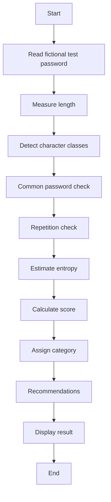

# Complete Project Guide — Password Strength Checker

## Abstract
A defensive Python tool that evaluates password quality using length, character diversity, entropy estimation, common-password detection, repetition detection, and recommendations.

## Objectives
- Measure password characteristics.
- Detect common/predictable patterns.
- Produce a human-readable strength category.
- Teach authentication-security fundamentals.
- Never store or transmit passwords.

## Requirements
Python 3.10+; standard library; Windows/Linux/macOS terminal.

## Setup and Usage
1. Enter the project directory.
2. Run ```powershell
python src/password_checker.py
```
3. Enter only a fictional test password.
4. Review the category and recommendations.
5. Repeat with several test cases.

Example: 'BlueTiger!2026' should generally score better than 'abc123'. Exact scoring depends on the implementation.

## Architecture
Input → validation → character-set analysis → common/repetition checks → entropy estimate → scoring → category → recommendations.

## Algorithm
1. Read password.
2. Calculate length.
3. Detect lowercase, uppercase, digits, and special characters.
4. Estimate character pool and entropy.
5. Check common-password set.
6. Check repeated characters.
7. Calculate score.
8. Assign strength category.
9. Display recommendations.

## Test Plan
| ID | Case | Expected |
|---|---|---|
| PW-01 | Empty | Safe handling |
| PW-02 | abc | Very Weak/Weak |
| PW-03 | password | Common-password warning |
| PW-04 | Fictional mixed password | Higher score |
| PW-05 | Repeated characters | Repetition warning |
| PW-06 | Long fictional passphrase | Strong depending on composition |

## Troubleshooting
- If Python is not found, install Python or use the Python launcher.
- If the score seems unexpected, inspect length, character classes, repetition, and common-password matching.
- Never debug with a real password.

## Security
Do not log, save, upload, or commit entered passwords. A score is only an estimate.

## Future Enhancements
Dictionary scoring, privacy-preserving breach checks, unit tests, GUI, configurable scoring, and passphrase guidance.

## Viva Q&A
**What is entropy?** An estimate of uncertainty based on length and assumed character space.
**Why check common passwords?** A complex-looking password can still be easy to guess if common.
**Does this prove a password is secure?** No; it is an educational heuristic.
**Why should passwords not be logged?** Logs can expose credentials.

## Flowchart

