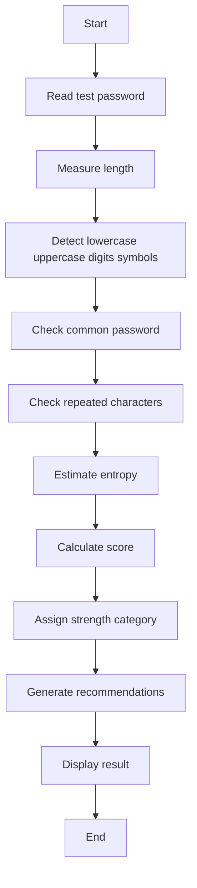

# Flowchart — Password Strength Checker

```mermaid
flowchart TD
    A[Start] --> B[Read test password]
    B --> C[Measure length]
    C --> D[Detect lowercase uppercase digits symbols]
    D --> E[Check common password]
    E --> F[Check repeated characters]
    F --> G[Estimate entropy]
    G --> H[Calculate score]
    H --> I[Assign strength category]
    I --> J[Generate recommendations]
    J --> K[Display result]
    K --> L[End]
```

## Data flow
Password input → analysis functions → score → category/recommendations → terminal output.
