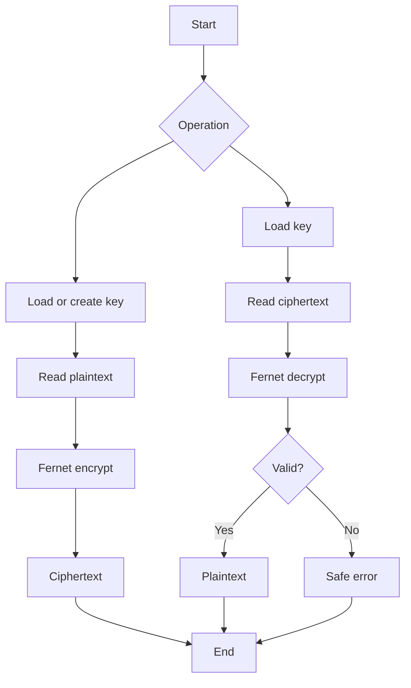

# Complete Project Guide — Text Encryption Tool

## Abstract
A local Python application demonstrating authenticated symmetric encryption of text using Fernet from the cryptography package.

## Objectives
- Demonstrate confidentiality and integrity.
- Generate/use a local secret key.
- Encrypt and decrypt text.
- Handle invalid ciphertext safely.
- Teach practical key management.

## Setup
```powershell
cd 02-text-encryption-tool
python -m pip install -r requirements.txt
python src/text_crypto.py
```

## Step-by-step Example
1. Start the program.
2. Choose encryption.
3. Enter fictional text such as 'Cybersecurity lab message'.
4. Record the ciphertext for the lab.
5. Choose decryption.
6. Supply the ciphertext and the same key.
7. Confirm the original text is recovered.
8. Test modified ciphertext.

## Architecture
CLI → key loading/creation → Fernet encrypt/decrypt → authentication/error handling → output.

## Key Management
The secret key is sensitive. Never commit secret.key. Losing the original key prevents legitimate decryption.

## Test Plan
| ID | Test | Expected |
|---|---|---|
| TX-01 | Normal text | Ciphertext |
| TX-02 | Valid ciphertext | Original restored |
| TX-03 | Unicode text | Correct round trip |
| TX-04 | Modified ciphertext | Authentication failure |
| TX-05 | Wrong key | Failure |
| TX-06 | Empty input | Safe handling |

## Troubleshooting
- Missing package: run the requirements installation command.
- Invalid token: ciphertext may be corrupted or paired with another key.
- Deleted key: old ciphertext cannot be decrypted with an unrelated new key.
- Never publish a key.

## Security
Do not print or commit keys. Avoid unnecessary plaintext persistence. Use only authorized data.

## Future Enhancements
OS-backed key storage, key rotation, unit tests, modular design, and secure file workflows.

## Viva Q&A
**What is symmetric encryption?** The same secret key is used for encryption and decryption.
**Why is key management important?** Possession of the key can enable decryption.
**What does authentication provide?** It helps detect ciphertext modification.
**What happens with a wrong key?** Authentication/decryption fails.

## Flowchart

\n
## Recruiter Review — Sample Input, Output & Technical Evidence

### Sample Input
~~~text
Operation: Encrypt
Plaintext: Cybersecurity lab message
~~~

### Representative Encryption Output
~~~text
Encryption successful.
Ciphertext: gAAAAAB...<generated ciphertext>...
Key file: secret.key
~~~

Fernet ciphertext changes between runs because the encryption process uses randomized values. The actual secret key must never be published.

### Sample Decryption Input
~~~text
Operation: Decrypt
Ciphertext: gAAAAAB...<generated ciphertext>...
Key: secret.key
~~~

### Expected Output
~~~text
Decryption successful.
Plaintext: Cybersecurity lab message
~~~

### Tampering Test
Change one character in the ciphertext.

~~~text
Expected: decryption/authentication failure
Reason: ciphertext integrity verification failed
~~~

### Test Evidence
| Test | Expected Result |
|---|---|
| Normal plaintext | Encrypted successfully |
| Same key + valid ciphertext | Original restored |
| Unicode text | Correct round trip |
| Wrong key | Failure |
| Modified ciphertext | Authentication failure |
| Missing key | Clear failure |
| Empty input | Safe handling |

### What a Recruiter Can Evaluate
- Understanding of symmetric cryptography
- Correct use of a standard cryptographic library
- Key-management awareness
- Authentication/integrity concepts
- Error handling
- Secure repository practices

### Security Design Decision
The project deliberately does not implement its own encryption primitive. Using an established cryptographic library is safer and more maintainable than attempting to write AES/Fernet internals manually.

### Interview Discussion
**Confidentiality:** unauthorized parties should not read the plaintext.

**Integrity/authentication:** modification of protected ciphertext should be detectable.

**Key management:** encryption is only as strong operationally as the protection of its secret key.

### Portfolio Demonstration
A recruiter can run one encrypt/decrypt round trip and then deliberately modify the ciphertext to observe the security control in action.
