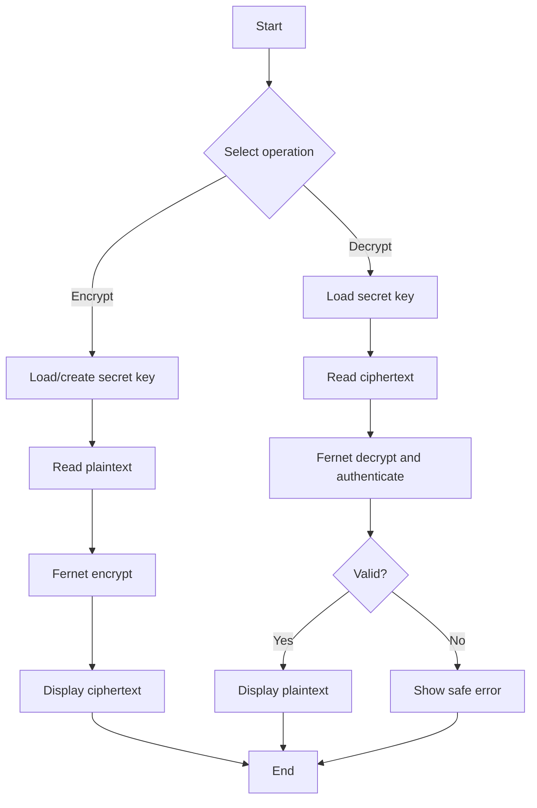

# Flowchart — Text Encryption Tool

```mermaid
flowchart TD
    A[Start] --> B{Select operation}
    B -->|Encrypt| C[Load/create secret key]
    C --> D[Read plaintext]
    D --> E[Fernet encrypt]
    E --> F[Display ciphertext]
    B -->|Decrypt| G[Load secret key]
    G --> H[Read ciphertext]
    H --> I[Fernet decrypt and authenticate]
    I --> J{Valid?}
    J -->|Yes| K[Display plaintext]
    J -->|No| L[Show safe error]
    F --> M[End]
    K --> M
    L --> M
```
