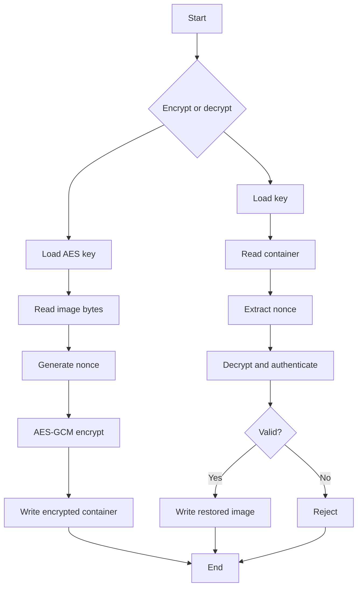

# Complete Project Guide — Image Encryption Tool

## Abstract
A Python utility that protects image bytes using AES-GCM, combining confidentiality with authenticated integrity.

## Objectives
- Demonstrate AES-GCM.
- Generate a random nonce.
- Encrypt image bytes.
- Detect modified ciphertext.
- Restore original bytes after authentication.

## Setup and Commands
```powershell
cd 03-image-encryption-tool
python -m pip install -r requirements.txt
python src/image_crypto.py encrypt input.jpg encrypted.bin
python src/image_crypto.py decrypt encrypted.bin restored.jpg
```

## Step-by-step
1. Choose a non-sensitive test image.
2. Run encryption.
3. Confirm encrypted.bin exists.
4. Keep the generated key safe.
5. Run decryption.
6. Open restored.jpg.
7. Compare the restored result with the original.
8. Modify a copy of encrypted data and verify rejection.

## Architecture
CLI → key management → image bytes → random nonce → AES-GCM → encrypted container → decrypt/authenticate → restored image.

## Cryptographic Concepts
AES is symmetric encryption. GCM provides authenticated encryption. A unique nonce is required for each encryption operation under the same key.

## Test Plan
| ID | Test | Expected |
|---|---|---|
| IM-01 | JPEG encryption | Encrypted file |
| IM-02 | JPEG decryption | Valid restored image |
| IM-03 | PNG encryption | Successful |
| IM-04 | Modified ciphertext | Authentication failure |
| IM-05 | Wrong key | Failure |
| IM-06 | Missing file | Clear error |

## Troubleshooting
- Dependency issue: install requirements.
- File not found: verify the path.
- Authentication failure: check key and file integrity.
- Broken output: verify original input and output paths.

## Security
Never commit encryption keys. Do not overwrite originals by default. Test with copies.

## Future Enhancements
Secure key storage, metadata validation, key rotation, unit tests, GUI, and structured errors.

## Viva Q&A
**Why use AES-GCM?** It provides confidentiality plus authentication.
**What is a nonce?** A value used with encryption to make operations distinct; it must not be improperly reused with the same key.
**What happens if ciphertext changes?** Authentication should fail.

## Flowchart

\n
## Recruiter Review — Sample Input, Output & Technical Evidence

### Sample Input
~~~text
File: input.jpg
Operation: encrypt
Command:
python src/image_crypto.py encrypt input.jpg encrypted.bin
~~~

### Representative Output
~~~text
Image encryption started
Input: input.jpg
Output: encrypted.bin
Algorithm: AES-GCM
Status: Encryption successful
~~~

### Sample Decryption
~~~text
python src/image_crypto.py decrypt encrypted.bin restored.jpg
~~~

Expected:
~~~text
Authentication successful
Decryption successful
Output: restored.jpg
~~~

### Strong Verification Method
Calculate SHA-256 for both original and restored files.

~~~text
Original SHA-256 : <hash A>
Restored SHA-256 : <hash A>
Verification     : MATCH
~~~

Matching hashes demonstrate that the restored bytes are identical to the original bytes.

### Tampering Test
Modify a byte in encrypted.bin and attempt decryption.

~~~text
Expected: authentication failure
Expected security behavior: modified ciphertext is rejected
~~~

### Test Evidence
| Test | Expected |
|---|---|
| JPEG input | Encryption succeeds |
| PNG input | Encryption succeeds |
| Correct key | Image restored |
| Wrong key | Rejected |
| Modified ciphertext | Rejected |
| Missing input | Clear error |
| Corrupt container | Safe failure |

### What a Recruiter Can Evaluate
- AES-GCM knowledge
- Binary file handling
- Nonce management
- Authenticated encryption
- Hash-based verification
- Error handling and test design
- Secure key handling

### Interview Discussion
A strong explanation is: AES provides symmetric encryption, GCM adds authenticated integrity, the nonce must be handled correctly, and the key must remain secret.

### Portfolio Demonstration
The project can be demonstrated end-to-end without exposing any confidential image or key: encrypt a sample image, decrypt it, compare hashes, then tamper with ciphertext and show rejection.
