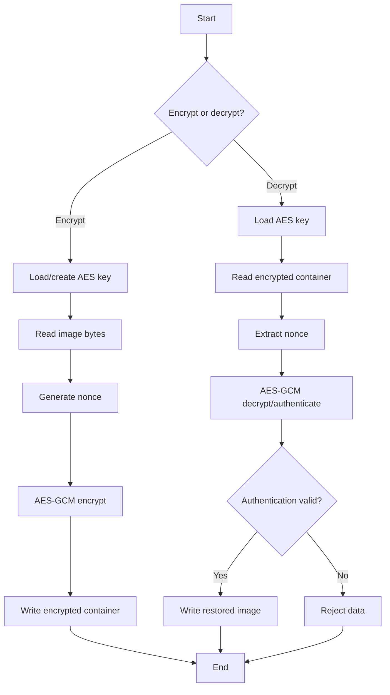

# Flowchart — Image Encryption Tool

```mermaid
flowchart TD
    A[Start] --> B{Encrypt or decrypt?}
    B -->|Encrypt| C[Load/create AES key]
    C --> D[Read image bytes]
    D --> E[Generate nonce]
    E --> F[AES-GCM encrypt]
    F --> G[Write encrypted container]
    B -->|Decrypt| H[Load AES key]
    H --> I[Read encrypted container]
    I --> J[Extract nonce]
    J --> K[AES-GCM decrypt/authenticate]
    K --> L{Authentication valid?}
    L -->|Yes| M[Write restored image]
    L -->|No| N[Reject data]
    G --> O[End]
    M --> O
    N --> O
```
