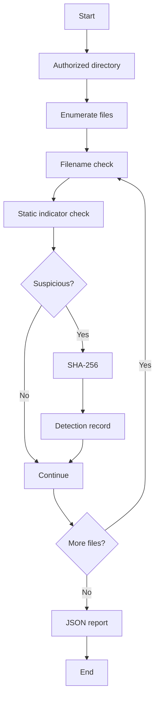

# Complete Project Guide — Safe Keylogger Monitor

## Critical Safety Boundary
This project is detection-only. It does not capture keystrokes, collect credentials, hide itself, establish covert persistence, or transmit keyboard data.

## Abstract
A defensive static-analysis tool that scans an authorized directory for suspicious keylogger-related filenames and code indicators and produces a JSON detection report.

## Objectives
- Demonstrate endpoint threat detection.
- Identify simple static indicators.
- Hash suspicious files with SHA-256.
- Produce evidence for analyst review.
- Teach false-positive handling.

## Setup
```powershell
cd 04-keylogger-monitor
python src/monitor.py --path ./lab_samples
```

## Safe Lab
1. Create a test directory.
2. Add a harmless text/Python file containing a test indicator.
3. Run the monitor.
4. Review the JSON report.
5. Verify filename, indicator, and hash.
6. Remove the lab artifact.
7. Repeat with a clean file.

## Architecture
Authorized path → file enumeration → filename indicators → safe static content indicators → SHA-256 hashing → JSON detections → analyst review.

## Detection Logic
Indicators can include suspicious filenames and strings such as pynput.keyboard, keyboard.on_press, and keylogger. These are signals, not proof of maliciousness.

## Test Plan
| ID | Test | Expected |
|---|---|---|
| KL-01 | Empty directory | No detections |
| KL-02 | Suspicious filename | Detection |
| KL-03 | Indicator in harmless sample | Detection |
| KL-04 | Normal file | No detection |
| KL-05 | Missing path | Clear error |
| KL-06 | Multiple samples | Multiple records |

## Troubleshooting
- Path error: verify --path.
- Too many alerts: review indicators and scan scope.
- Permission error: use an authorized readable directory.
- Unknown real malware: do not execute it; follow incident-response procedures.

## Security and Ethics
Never add keyboard hooks or credential collection. Keep demonstrations synthetic and isolated.

## Future Enhancements
Configurable indicators, severity scoring, allowlists, YARA in an isolated defensive lab, quarantine workflows, SIEM output.

## Viva Q&A
**Why is this not a keylogger?** It never receives keyboard events or stores keystrokes.
**Is a filename match proof of malware?** No, it is an indicator.
**Why hash files?** To identify and compare the exact file examined.
**What is a false positive?** A benign file incorrectly flagged by a rule.

## Flowchart

\n
## Recruiter Review — Sample Input, Output & Technical Evidence

### Safe Synthetic Input
Directory:
~~~text
lab_samples/
├── normal_notes.txt
├── keylogger.py
└── readme.txt
~~~

The test file should contain only a harmless detection marker, for example:
~~~python
# LAB ONLY
# Test indicator: keylogger
~~~

It must not contain keyboard hooks, credential capture, persistence, or transmission logic.

### Command
~~~powershell
python src/monitor.py --path ./lab_samples
~~~

### Representative Output
~~~json
{
  "scan_path": "./lab_samples",
  "detections": [
    {
      "file": "keylogger.py",
      "reason": "suspicious filename",
      "sha256": "<calculated SHA-256>"
    }
  ]
}
~~~

The exact hash depends on the file bytes.

### Detection Test Matrix
| Test | Expected |
|---|---|
| Empty directory | No detections |
| keylogger.py | Detection |
| Static indicator string | Detection |
| normal_notes.txt | No detection |
| Missing path | Clear error |
| Multiple suspicious samples | Multiple records |

### False-Positive Review
A filename or string match is an indicator, not proof of malware. Professional detection should combine multiple signals and provide context for analyst review.

### What a Recruiter Can Evaluate
- Defensive security mindset
- IOC/static-analysis concepts
- SHA-256 evidence generation
- JSON reporting
- False-positive awareness
- Safe project boundaries
- Endpoint-security fundamentals

### Interview Discussion
**Why hash a suspicious file?** To identify the exact artifact and make later comparison possible.

**Why not automatically label it malware?** A detection rule can match legitimate security research or developer files.

**How would you improve it?** Add configurable indicators, severity, allowlists, file metadata, behavioral telemetry, and controlled SIEM integration.

### Portfolio Demonstration
This project is especially useful in an interview because it demonstrates that the candidate understands the difference between offensive capability and defensive detection.
