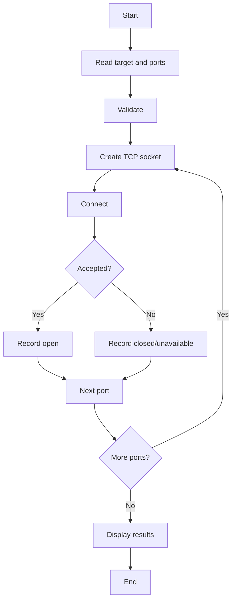

# Complete Project Guide — Network Scanner

## Authorization
Scan only localhost, your own devices, or explicitly authorized systems. Do not use this project for unauthorized reconnaissance or exploitation.

## Abstract
A basic TCP connect scanner for authorized systems and cybersecurity labs. It demonstrates sockets, ports, timeouts, and service exposure.

## Objectives
- Understand TCP ports.
- Implement socket connections.
- Parse port ranges.
- Handle timeouts.
- Report reachable ports.

## Setup and Example
```powershell
cd 05-network-scanner
python src/scanner.py 127.0.0.1 --ports 1-1024
```

## Safe Lab Procedure
1. Start a local test service.
2. Identify its TCP port.
3. Scan only 127.0.0.1.
4. Confirm the service port is reported open.
5. Stop the service.
6. Scan again and compare results.
7. Document the conditions.

## Architecture
CLI → target/range validation → socket creation → TCP connect attempt → result → next port → summary.

## Technical Concepts
A TCP connect scan attempts a normal TCP connection. An open result means the connection was accepted; it does not mean the service is vulnerable.

## Test Plan
| ID | Test | Expected |
|---|---|---|
| NS-01 | Localhost scan | Completes |
| NS-02 | Known local service | Open detected |
| NS-03 | Closed local port | Not open |
| NS-04 | Invalid range | Validation error |
| NS-05 | Unavailable target | Safe error |
| NS-06 | Small range | Fast completion |

## Troubleshooting
- No open ports: start a local test service.
- Timeout: service may be unavailable or filtering.
- Invalid range: use the documented syntax.
- Permission/network policy: remain inside the lab.

## Security
Do not add exploitation, credential attacks, stealth/evasion, or unauthorized discovery. Keep scan intensity conservative.

## Future Enhancements
IPv6, controlled concurrency, JSON output, service identification, configurable timeout, and unit tests.

## Viva Q&A
**What is a port?** A logical endpoint used by network services.
**TCP vs UDP?** TCP is connection-oriented; UDP is connectionless.
**Does an open port mean a vulnerability?** No.
**Why use timeouts?** To prevent indefinite waiting.

## Flowchart

