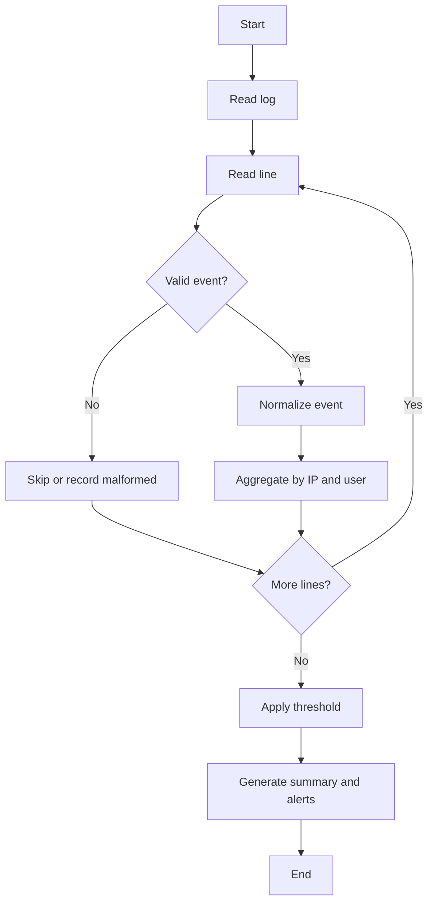

# Complete Project Guide — Log / SIEM Analyzer

## Abstract
A lightweight SIEM-style analyzer that parses synthetic authentication events, aggregates failed logins by source IP/user, and applies a threshold alert rule.

## Objectives
- Understand security-event normalization.
- Parse structured log records.
- Aggregate events.
- Detect repeated authentication failures.
- Produce analyst-friendly results.

## Setup
```powershell
cd 06-log-siem-analyzer
python src/analyzer.py sample_logs/auth.log
```

## Step-by-step
1. Open the synthetic sample log.
2. Inspect event fields.
3. Run the analyzer.
4. Review counts by source IP and username.
5. Identify threshold alerts.
6. Add synthetic events.
7. Run again and compare.
8. Test malformed records.

## Architecture
Log file → parser → normalized event → aggregation → threshold rule → alerts/summary.

## Detection Logic
The educational rule alerts when failed-login count for a source IP reaches the configured threshold (five in the current implementation).

## SIEM Concepts
A SIEM combines collection, normalization, correlation, detection, and investigation workflows. This project demonstrates a small local subset.

## Test Plan
| ID | Test | Expected |
|---|---|---|
| SI-01 | Valid event | Parsed |
| SI-02 | Five failures from one IP | Alert |
| SI-03 | Four failures | No threshold alert |
| SI-04 | Multiple users | Correct aggregation |
| SI-05 | Malformed line | Safe handling |
| SI-06 | Empty log | Empty summary |
| SI-07 | Missing file | Clear error |

## Troubleshooting
- No events: compare the log format with the parser.
- Wrong count: inspect duplicate lines and IPs.
- Missing file: check the path.
- Real logs: sanitize sensitive information; use synthetic logs in GitHub.

## Security
Never commit real authentication logs, credentials, tokens, or personal information. Production thresholds should be configurable.

## Future Enhancements
Time-window correlation, multiple rules, severity, JSON/CSV output, dashboards, alert deduplication, and MITRE ATT&CK mapping.

## Viva Q&A
**What is SIEM?** Security Information and Event Management for collecting, correlating, detecting, and investigating security events.
**Why aggregate logs?** Patterns become easier to detect.
**What is threshold detection?** An alert is generated when a count reaches a defined limit.
**Why use synthetic logs?** They demonstrate the project without exposing sensitive data.

## Flowchart

